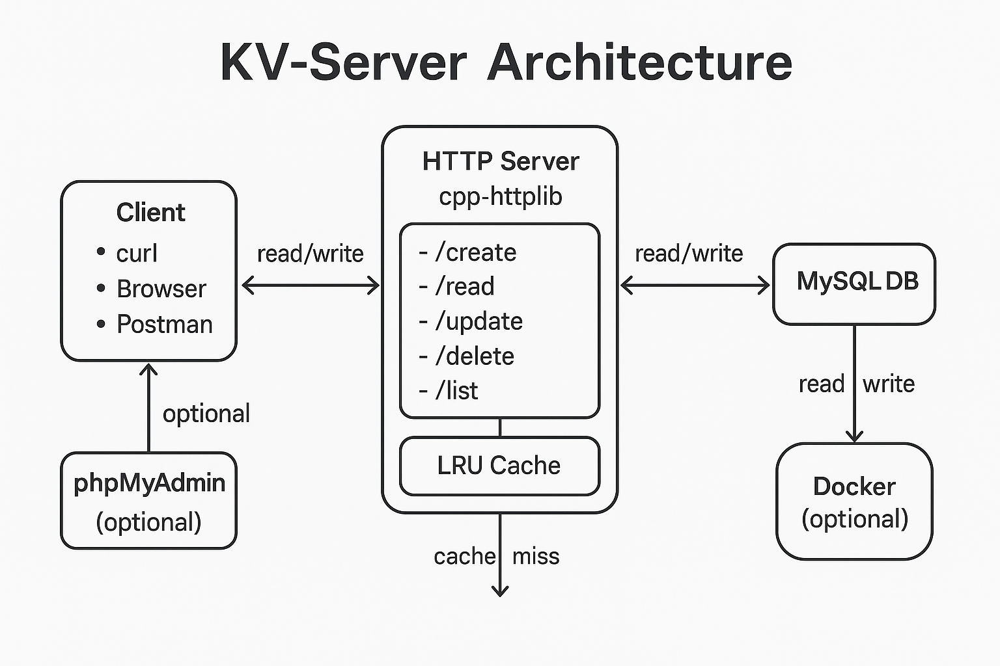

<<<<<<< HEAD
# KV Server (HTTP + LRU Cache + MySQL)

## Build
Requirements: CMake ≥3.18, a C++20 compiler, MySQL/MariaDB client libs (libmysqlclient), and internet (for CMake FetchContent).

### Arch Linux
```bash
sudo pacman -S base-devel cmake gcc mariadb-libs mariadb
# (mariadb provides mysql server if you want local DB)

=======
# KV-Server

A lightweight **HTTP-based Key-Value Store** built in **C++**, backed by **MySQL** for persistence and an **LRU cache** for fast reads.

It exposes REST endpoints (`/create`, `/read`, `/update`, `/delete`, `/list`) over HTTP - allowing clients to perform full CRUD operations.

---

## Features

- Simple REST API (create, read, update, delete, list)
- Persistent MySQL backend
- In-memory LRU cache (for speed)
- CMake-based build system
- Clean modular C++20 design

---

## Prerequisites

Make sure these are installed (on Arch Linux):

```bash
sudo paru -S cmake gcc mariadb mariadb-libs
```
---

## Server Architecture Diagram



---

## Setup Instructions

### 1. Start MySQL (MariaDB)

```bash
sudo systemctl start mariadb
```
(Optional but recommended on boot:)

```bash
sudo systemctl enable mariadb
```
---

### 2. Create the database and table

Launch MySQL:

```bash
mysql -u root -p
```
Then inside MySQL:

```sql
CREATE DATABASE kv_store;
USE kv_store;

CREATE TABLE kv_store (
key VARCHAR(255) PRIMARY KEY,
value TEXT
);
```
---

## Build the Project

From the root directory of the project:

```bash
mkdir build && cd build
cmake .. && Make
```
This compiles everything and generates:

- `kvserver` → main HTTP key-value server
- `loadgen` → optional load-testing client

---

## Run the Server

```bash
./kvserver
```
If setup is correct, you’ll see:

Connected to MySQL and cache initialized.
Server running on http://localhost:7000

---

## Using the API (via curl)

All endpoints use HTTP query parameters.

### Create

```bash
curl -X POST "http://127.0.0.1:7000/create?key=1&value=hello"
```
### Read

```bash
curl "http://127.0.0.1:7000/read?key=1"
```
### Update

```bash
curl -X PUT "http://127.0.0.1:7000/update?key=1&value=newvalue"
```
### Delete

```bash
curl -X DELETE "http://127.0.0.1:7000/delete?key=1"
```
### List all key-value pairs

```bash
curl "http://127.0.0.1:7000/list"
```
>>>>>>> 47a2e8c (Updating..)
